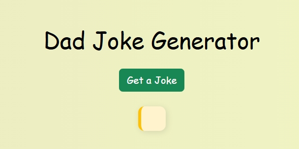
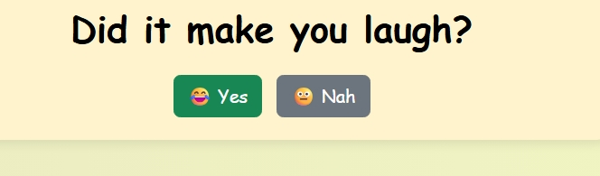

# Dad Joke Generator
Nele112

## Demo linkki:
Pääset sovellukseen tästä: https://dadjokesprojekti.netlify.app/

## Työnjako
Tämä projekti on tehty yksilötyönä.

## Sisällysluettelo

- [Tietoa sovelluksesta](#tietoa-sovelluksesta)
- [Kuvakaappaukset](#kuvakaappaukset)
- [Teknologiat](#teknologiat)
- [Sovelluksen käyttö](#sovelluksen-kaytto)
- [Toteutustapa](#toteutustapa)
- [Tila](#tila)
- [Lisenssi](#lisenssi)

## Tietoa sovelluksesta
Dad Joke Generator on pieni verkkosovellus, jonka ideana on tuoda käyttäjälle yksi satunnainen vitsi kerrallaan ja samalla vähän naurua.
Käyttäjä painaa nappia, jolloin sovellus hakee vitsin ulkoisesta rajapinnasta (API Ninjas). Vitsin jälkeen näytetään satunnaisesti valittu lyhyt nauruvideo ja lopuksi kysytään, oliko vitsi hyvä vai ei. Vastauksesta riippuen näytetään lyhyt palaute.

## Kuvakaappaukset

Aloitusnäkymä:

Vitsi haettu ja video käynnissä:

Palautepainikkeet näkyvissä:

## Teknologiat

1. HTML5
Rakenteen pohja. Sivun sisältö, kuten otsikot, painikkeet ja vitsin esityspaikka, on rakennettu HTML:llä.

2. CSS# + Bootstrap5
Sivun ulkoasu, värit, painikkeiden tyyli, asettelu ja responsiivisuus. Bootsrap helpottaa nopeaa ja siistiä muotoilua.

3. JavaScript (jQuery 3.7.1)
Toiminnallisuus: nappia klikatessa tapahtuvat asiat, vitsin hakeminen, videon lisääminen DOM:iin ja palautepainikkeiden logiikka.

4. Netlify Functions (serverless)
Taustatoiminto, joka suojaa API-avaimen ja hoitaa API-kutsun. Käytetään erillistä joke.js-tiedostoa Netlifyssä.

5. Node.js + node-fetch (versio 2.7.0)
Netlify Functionsin sisällä käytettävä ympäristö, joka mahdollistaa HTTP-pyynnön tekemisen rajapintaan (API).

6. API Ninjas (Dad Jokes API)
Ulkoinen rajapinta, mistä haetaan satunnaisia vitsejä. Sovellus ei sisällä vitsejä itse, vaan hakee ne dynaamisesti.

## Sovelluksen käyttö
Sovellusta voi käyttää suoraan selaimessa. Käyttö tapahtuu näin:
1. Ava osoite https://dadjokesprojekti.netlify.app
2. Paina "Get a Joke"- painiketta
3. Vitsi tulee näkyviin ja samalla näytetään lyhyt nauruvideo
4. Vastaa palautekysymykseen: "Did it make you laugh?"
5. Sovellus antaa vastauksesi perusteella pienen kommentin.

## Toteutustapa
Sovellus toimii niin, että käyttäjä painaa "Get a Joke"- painiketta ja silloin käynnistyy JavaScript-funktio. Tämä funktio lähettää pyynnön omaan Netlify function- taustatoimintoon (joke.js), joka taas hakee vitsin ulkoisesta API-rajapinnasta (API Ninjas). API-avain on suojattu eikä näy selaimessa, koska se luetaan palvelinpuolella ympäristömuuttujasta.
Kun vitsi on haettu, se näytetään sivulla ja siihen alle lisätään satunnainen nauruvideo, joka käynnistyy automaattisesti. Tämän jälkeen näytetään palautekysymys, jossa käyttäjä voi valita, naurattiko vai ei. Valinnan perusteella näytetään pieni palaute.
Käytössä on JQueryn avulla tehty DOM-manipulaatio, joka hoitaa vitsin ja videon näyttämisen sekä palautepainikkeiden lisäämisen ja käsittelyn. Bootstrap on käytössä ulkoasun tyylittelyssä ja koko projekti on julkaistu Netlify-palvelussa.

## Tila
Tämä projekti on tehty koulutyönä ja se on valmis tehtävänannon mukaisesti. 
Tällä hetkellä ei ole suunniteltu uusia ominaisuuksia tai jatkokehitystä.

## Lisenssi
Tämä projekti on lisensoitu [MIT-lisenssillä](LICENSE).